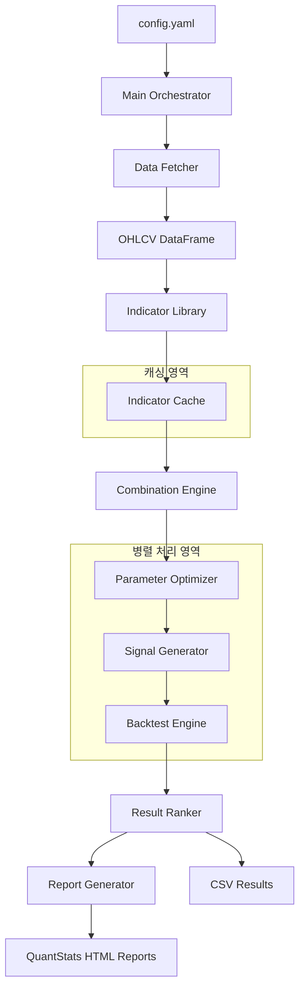
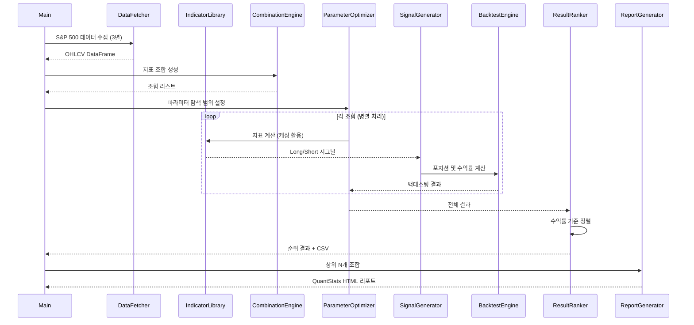
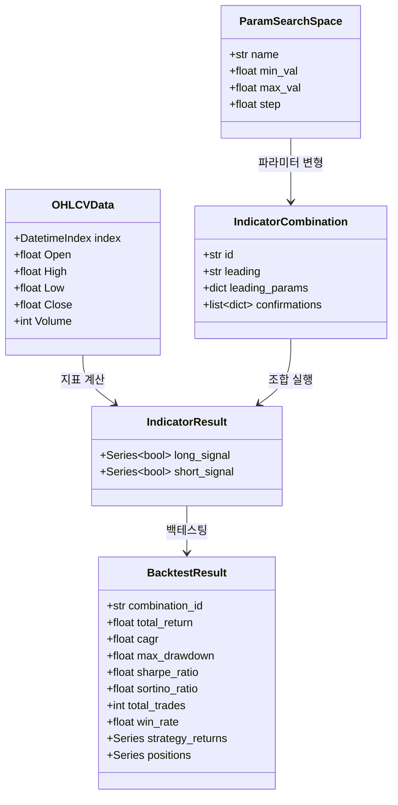

# 설계 문서: S&P 500 QuantStats 백테스팅 시스템

## 개요

본 시스템은 TradingView Pine Script v6 기반 "DIY Custom Strategy Builder [ZP]"의 37개 리딩 지표와 45개 이상의 확인 지표를 Python으로 재구현하고, S&P 500 지수를 대상으로 모든 가능한 지표 조합 및 파라미터 변형에 대해 Long/Short 백테스팅을 수행하는 시스템이다.

핵심 목표:

- Pine Script 지표 로직의 정확한 Python 재구현 (pandas/numpy 벡터화 연산)
- 조합 폭발 문제를 관리하면서 체계적인 전략 탐색
- 멀티프로세싱 기반 병렬 백테스팅으로 실용적 시간 내 처리
- QuantStats를 활용한 상세 성과 분석 리포트 생성

## 아키텍처

### 전체 시스템 아키텍처



### 모듈 구조

```
sp500_backtest/
├── main.py                    # 메인 오케스트레이터
├── config.yaml                # 설정 파일
├── requirements.txt           # 패키지 의존성
├── data/
│   └── fetcher.py             # yfinance 데이터 수집
├── indicators/
│   ├── __init__.py
│   ├── base.py                # 지표 기본 인터페이스
│   ├── leading.py             # 37개 리딩 지표
│   ├── confirmation.py        # 45개+ 확인 지표
│   └── utils.py               # 공통 유틸리티 (MA, ATR 등)
├── engine/
│   ├── __init__.py
│   ├── combination.py         # 조합 생성 엔진
│   ├── optimizer.py           # 파라미터 최적화
│   ├── signal.py              # 시그널 생성기
│   └── backtest.py            # 백테스팅 엔진
├── results/
│   ├── ranker.py              # 결과 정렬/순위
│   └── reporter.py            # QuantStats 리포트 생성
├── checkpoint/                # 체크포인트 저장 디렉토리
└── output/                    # 결과 출력 디렉토리
    ├── results.csv
    └── reports/
```

### 실행 흐름



## 컴포넌트 및 인터페이스

### 1. Data Fetcher (`data/fetcher.py`)

```python
class DataFetcher:
    """S&P 500 OHLCV 데이터 수집기"""

    def fetch(self, symbol: str = "^GSPC", period: str = "3y") -> pd.DataFrame:
        """
        yfinance를 사용하여 OHLCV 데이터를 수집한다.

        Returns:
            pd.DataFrame: columns=['Open','High','Low','Close','Volume'], index=DatetimeIndex
        """

    def _validate_and_clean(self, df: pd.DataFrame) -> pd.DataFrame:
        """결측값 전방 채움(forward fill) 처리"""
```

### 2. Indicator Library (`indicators/`)

#### 기본 인터페이스 (`indicators/base.py`)

```python
@dataclass
class IndicatorResult:
    """지표 계산 결과"""
    long_signal: pd.Series   # True/False Series
    short_signal: pd.Series  # True/False Series

class BaseIndicator(ABC):
    """모든 지표의 기본 클래스"""

    @property
    @abstractmethod
    def name(self) -> str:
        """지표 이름"""

    @property
    @abstractmethod
    def default_params(self) -> dict:
        """Pine Script 기본 파라미터"""

    @abstractmethod
    def calculate(self, df: pd.DataFrame, params: dict | None = None) -> IndicatorResult:
        """
        지표를 계산하여 Long/Short 시그널을 반환한다.

        Args:
            df: OHLCV DataFrame
            params: 파라미터 딕셔너리 (None이면 기본값 사용)
        Returns:
            IndicatorResult: long_signal, short_signal Series
        """

class ConfirmationIndicator(BaseIndicator):
    """확인 지표 기본 클래스 (서브타입 지원)"""

    @property
    def subtypes(self) -> list[str]:
        """지원하는 서브타입 목록"""
        return []

    def calculate(self, df: pd.DataFrame, params: dict | None = None,
                  subtype: str | None = None) -> IndicatorResult:
        """서브타입을 포함한 지표 계산"""
```

#### 리딩 지표 (`indicators/leading.py`)

Pine Script에서 재구현할 37개 리딩 지표:

| #   | 지표명                          | 핵심 로직                           | 주요 파라미터                         |
| --- | ------------------------------- | ----------------------------------- | ------------------------------------- |
| 1   | Range Filter                    | smoothrng + rngfilt 함수, 방향 추적 | period=100, mult=3.0                  |
| 2   | RQK (Rational Quadratic Kernel) | Nadaraya-Watson 커널 회귀           | lookback=8, relative_weight=8         |
| 3   | Supertrend                      | ATR 기반 상/하 밴드                 | atr_period=10, factor=3.0             |
| 4   | Half Trend                      | ATR 기반 트렌드 추적                | amplitude=2, channel_deviation=2      |
| 5   | Ichimoku Cloud                  | 전환선/기준선/선행스팬              | tenkan=9, kijun=26, senkou=52         |
| 6   | SuperIchi                       | Ichimoku 4조건 동시 충족            | tenkan=9, kijun=26, senkou=52         |
| 7   | TSI                             | 이중 평활 모멘텀                    | long=25, short=13, signal=13          |
| 8   | TDFI                            | 트렌드 방향 힘 지수                 | lookback=13, mma=13, filter_high=0.05 |
| 9   | Trendline Breakout              | 피봇 기반 추세선 돌파               | length=14                             |
| 10  | Range Detector                  | ATR 기반 레인지 감지/돌파           | length=20, mult=1.0, atr_len=500      |
| 11  | HACOLT                          | Heiken-Ashi 캔들 오실레이터         | tema_period=55, ema_period=60         |
| 12  | Donchian Trend Ribbon           | Donchian 채널 기반 리본             | period=15                             |
| 13  | Stochastic                      | K/D 크로스오버                      | length=14, smooth_k=3, smooth_d=3     |
| 14  | RSI                             | RSI/MA 크로스                       | length=14, ma_length=14               |
| 15  | ROC                             | 변화율 제로라인 크로스              | length=9                              |
| 16  | VWAP                            | 가격 vs VWAP 비교                   | anchor="Session"                      |
| 17  | CCI                             | 상/하 밴드 돌파                     | length=20, upper=100, lower=-100      |
| 18  | 2 EMA Cross                     | 빠른/느린 EMA 크로스                | fast=50, slow=200                     |
| 19  | 3 EMA Cross                     | 3개 EMA 정렬                        | ema1=9, ema2=21, ema3=55              |
| 20  | B-Xtrender                      | RSI+EMA 기반 트렌드                 | short_l1=5, short_l2=20, short_l3=15  |
| 21  | Bull Bear Power Trend           | 불/베어 파워 비교                   | period=50, atr=5                      |
| 22  | DPO                             | 디트렌디드 가격 오실레이터          | period=10                             |
| 23  | BB Oscillator                   | 볼린저 밴드 오실레이터              | length=20, stddev=2.0                 |
| 24  | Chandelier Exit                 | ATR 기반 추세 추적                  | atr_period=22, mult=3.0               |
| 25  | DMI (ADX)                       | 방향성 지수                         | length=14, adx_smoothing=14           |
| 26  | Parabolic SAR                   | 포물선 SAR                          | start=0.02, increment=0.02, max=0.2   |
| 27  | MACD                            | MACD/시그널 크로스                  | fast=12, slow=26, signal=9            |
| 28  | SSL Channel                     | SMA High/Low 채널                   | period=10                             |
| 29  | Waddah Attar Explosion          | MACD+BB 기반 폭발                   | sensitivity=150, fast=20, slow=40     |
| 30  | Chaikin Money Flow              | 자금 흐름 지표                      | length=20                             |
| 31  | Vortex Index                    | 소용돌이 지표                       | period=14                             |
| 32  | STC (Schaff Trend Cycle)        | MACD+Stochastic 결합                | fast=23, slow=50, cycle=10            |
| 33  | Awesome Oscillator              | HL2 SMA 차이                        | fast=5, slow=34                       |
| 34  | Volatility Oscillator           | Close-Open 표준편차                 | length=100                            |
| 35  | Wolfpack Id                     | 빠른/느린 EMA 스프레드              | fast=3, slow=8                        |
| 36  | QQE Mod                         | RSI 기반 QQE                        | rsi_period=6, sf=5, qqe_factor=3      |
| 37  | Hull Suite                      | Hull MA 방향                        | length=55, mode="Hma"                 |

#### 확인 지표 (`indicators/confirmation.py`)

확인 지표는 리딩 지표와 동일한 계산 로직을 공유하되, 서브타입에 따라 시그널 생성 방식이 다르다.

서브타입이 있는 주요 확인 지표:

| 확인 지표             | 서브타입                                             |
| --------------------- | ---------------------------------------------------- |
| Range Filter          | Default, DW                                          |
| TSI                   | Signal Cross, Zero line cross                        |
| B-Xtrender            | Short term, Short and Long term                      |
| Bull Bear Power Trend | Follow Trend, Without Trend                          |
| BB Oscillator         | Entering Band, Exiting Band                          |
| Stochastic            | CrossOver, OB&OS levels, %K above/below %D           |
| RSI                   | RSI MA Cross, RSI Exits OB/OS, RSI Level             |
| MACD                  | MACD Crossover, Zero line crossover                  |
| Awesome Oscillator    | Zero Line Cross, AC Zero Line Cross, AC Momentum Bar |
| DMI-ADX               | Adx Only, Adx & +Di -Di, Advance                     |
| Damiani Volatility    | Simple, Threshold, 10p Difference                    |
| Volume                | volume above MA, Simple, Delta                       |
| QQE Mod               | Line, Bar, Line & Bar                                |
| Vortex Indicator      | Simple, Advance                                      |

추가 확인 전용 지표: EMA Filter, McGinley Dynamic, Choppiness Index, RSI MA Direction, RSI Limit, RSI MA Limit

#### 공통 유틸리티 (`indicators/utils.py`)

```python
def ma(source: pd.Series, length: int, ma_type: str = "EMA") -> pd.Series:
    """다양한 이동평균 계산 (SMA, EMA, RMA, WMA, HMA, VWMA)"""

def atr(df: pd.DataFrame, length: int) -> pd.Series:
    """Average True Range 계산"""

def crossover(series_a: pd.Series, series_b: pd.Series) -> pd.Series:
    """크로스오버 감지 (a가 b를 상향 돌파)"""

def crossunder(series_a: pd.Series, series_b: pd.Series) -> pd.Series:
    """크로스언더 감지 (a가 b를 하향 돌파)"""

def stoch(close: pd.Series, high: pd.Series, low: pd.Series, length: int) -> pd.Series:
    """Stochastic %K 계산"""

def rsi(source: pd.Series, length: int) -> pd.Series:
    """RSI 계산"""

def true_range(df: pd.DataFrame) -> pd.Series:
    """True Range 계산"""
```

### 3. Combination Engine (`engine/combination.py`)

```python
@dataclass
class IndicatorCombination:
    """지표 조합 정의"""
    id: str                              # 고유 식별자
    leading: str                         # 리딩 지표 이름
    leading_params: dict                 # 리딩 지표 파라미터
    confirmations: list[dict]            # 확인 지표 리스트 [{name, subtype, params}]

class CombinationEngine:
    """지표 조합 생성 및 관리"""

    def generate(self, max_confirmations: int = 3,
                 max_combinations: int = 100_000) -> list[IndicatorCombination]:
        """
        모든 가능한 리딩+확인 지표 조합을 생성한다.
        조합 수가 max_combinations를 초과하면 max_confirmations를 자동 축소한다.
        """

    def _estimate_total(self, max_confirmations: int) -> int:
        """총 조합 수 추정"""
```

### 4. Parameter Optimizer (`engine/optimizer.py`)

```python
@dataclass
class ParamSearchSpace:
    """파라미터 탐색 공간 정의"""
    name: str           # 파라미터 이름
    min_val: float      # 최소값
    max_val: float      # 최대값
    step: float         # 스텝 크기

class ParameterOptimizer:
    """파라미터 최적화 엔진"""

    def __init__(self, method: str = "grid", n_workers: int = -1):
        """
        Args:
            method: "grid" 또는 "random"
            n_workers: 병렬 워커 수 (-1이면 CPU 코어 수)
        """

    def optimize(self, combination: IndicatorCombination,
                 df: pd.DataFrame,
                 search_spaces: dict[str, list[ParamSearchSpace]]) -> list[BacktestResult]:
        """주어진 조합에 대해 파라미터 최적화를 수행한다."""
```

### 5. Signal Generator (`engine/signal.py`)

```python
class SignalGenerator:
    """매매 시그널 생성기"""

    def generate(self, leading_result: IndicatorResult,
                 confirmation_results: list[IndicatorResult],
                 signal_expiry: int = 3,
                 alternate_signal: bool = True) -> pd.Series:
        """
        리딩 지표 시그널과 확인 지표 필터를 결합하여 최종 포지션 시그널을 생성한다.

        Signal Expiry 로직:
        - 리딩 지표 시그널 발생 후 signal_expiry 캔들 이내에
          모든 확인 지표가 확인되지 않으면 시그널 무효화

        Alternate Signal 로직:
        - 연속 동일 방향 시그널 필터링 (Long 후 다시 Long 무시)

        Returns:
            pd.Series: 1(Long), -1(Short), 0(무포지션)
        """
```

### 6. Backtest Engine (`engine/backtest.py`)

```python
@dataclass
class BacktestResult:
    """백테스팅 결과"""
    combination_id: str          # 조합 식별자
    total_return: float          # 총 수익률
    cagr: float                  # 연환산 수익률
    max_drawdown: float          # 최대 낙폭
    sharpe_ratio: float          # 샤프 비율
    sortino_ratio: float         # 소르티노 비율
    total_trades: int            # 총 거래 횟수
    win_rate: float              # 승률
    strategy_returns: pd.Series  # 일별 수익률 Series
    positions: pd.Series         # 포지션 Series

class BacktestEngine:
    """벡터화 백테스팅 엔진"""

    def run(self, positions: pd.Series, prices: pd.Series,
            transaction_cost: float = 0.001) -> BacktestResult:
        """
        포지션 시그널 기반 백테스팅을 수행한다.

        - 시그널 발생 다음 거래일부터 포지션 반영 (shift(1))
        - 포지션 변경 시 거래 비용 차감
        - 벡터화 연산으로 수익률 계산
        """
```

### 7. Result Ranker (`results/ranker.py`)

```python
class ResultRanker:
    """결과 정렬 및 순위 산출"""

    def rank(self, results: list[BacktestResult],
             sort_by: str = "total_return") -> pd.DataFrame:
        """
        결과를 지정된 기준으로 정렬한다.
        sort_by: "total_return", "cagr", "sharpe_ratio"
        """

    def save_csv(self, ranked_df: pd.DataFrame, path: str) -> None:
        """결과를 CSV로 저장"""

    def print_summary(self, ranked_df: pd.DataFrame, top_n: int = 20) -> None:
        """상위 N개 조합 요약 출력"""
```

### 8. Report Generator (`results/reporter.py`)

```python
class ReportGenerator:
    """QuantStats 성과 리포트 생성기"""

    def generate(self, results: list[BacktestResult],
                 benchmark_returns: pd.Series,
                 top_n: int = 5,
                 output_dir: str = "output/reports") -> None:
        """
        상위 N개 조합에 대해 QuantStats HTML 리포트를 생성한다.
        파일명: rank{순위:02d}_{리딩지표}_{확인지표들}.html
        """
```

### 9. Indicator Cache

```python
class IndicatorCache:
    """지표 계산 결과 캐싱"""

    def get_or_compute(self, indicator_name: str, params: dict,
                       df: pd.DataFrame,
                       compute_fn: Callable) -> IndicatorResult:
        """
        캐시에 결과가 있으면 반환, 없으면 계산 후 캐싱.
        키: (indicator_name, frozenset(params.items()))
        """
```

## 데이터 모델

### 핵심 데이터 구조



### 설정 파일 구조 (`config.yaml`)

```yaml
# 데이터 수집 설정
data:
  symbol: "^GSPC" # S&P 500 심볼
  period: "3y" # 수집 기간

# 조합 설정
combination:
  max_confirmations: 3 # 최대 확인 지표 수
  max_combinations: 100000 # 최대 조합 수 한도

# 백테스팅 설정
backtest:
  transaction_cost: 0.001 # 거래 비용 (0.1%)
  signal_expiry: 3 # 시그널 만료 캔들 수
  alternate_signal: true # 연속 동일 방향 필터링

# 파라미터 최적화 설정
optimizer:
  method: "grid" # grid 또는 random
  random_iterations: 1000 # random search 시 반복 횟수

# 결과 설정
results:
  sort_by: "total_return" # 정렬 기준
  top_n_display: 20 # 콘솔 출력 상위 N개
  top_n_report: 5 # QuantStats 리포트 생성 상위 N개

# 성능 설정
performance:
  n_workers: -1 # 병렬 워커 수 (-1: CPU 코어 수)
  checkpoint_interval: 100 # 체크포인트 저장 간격 (조합 수)

# 파라미터 탐색 범위 (지표별)
param_ranges:
  ema_cross:
    fast_period: { min: 5, max: 50, step: 5 }
    slow_period: { min: 20, max: 200, step: 10 }
  supertrend:
    atr_period: { min: 5, max: 30, step: 5 }
    factor: { min: 1.0, max: 5.0, step: 0.5 }
  rsi:
    length: { min: 7, max: 21, step: 2 }
  # ... 기타 지표별 탐색 범위
```

### 체크포인트 데이터 구조

```python
@dataclass
class Checkpoint:
    """중간 결과 체크포인트"""
    completed_combinations: list[str]   # 완료된 조합 ID 목록
    results: list[BacktestResult]       # 완료된 결과
    timestamp: datetime                 # 저장 시각
    total_combinations: int             # 전체 조합 수
```

### 캐시 키 구조

지표 캐시의 키는 `(indicator_name, frozenset(params.items()))` 튜플로 구성된다. 동일 지표가 여러 조합에서 사용될 때 중복 계산을 방지한다.

예시:

```python
cache_key = ("RSI", frozenset({"length": 14, "ma_length": 14}.items()))
```

## 정확성 속성 (Correctness Properties)

_정확성 속성(Property)은 시스템의 모든 유효한 실행에서 참이어야 하는 특성 또는 동작이다. 속성은 사람이 읽을 수 있는 명세와 기계가 검증할 수 있는 정확성 보장 사이의 다리 역할을 한다._

### Property 1: 지표 반환값 형식 불변성

_For any_ 지표(리딩 또는 확인)와 _for any_ 유효한 OHLCV DataFrame 및 파라미터 딕셔너리(서브타입 포함), 지표 계산 결과의 `long_signal`과 `short_signal`은 반드시 입력 DataFrame과 동일한 길이의 boolean pandas Series여야 한다.

**Validates: Requirements 2.2, 2.4, 3.2, 3.3**

### Property 2: 시그널 AND 조건 결합

_For any_ 리딩 지표 시그널 Series와 _for any_ 확인 지표 시그널 Series 리스트에 대해, Signal Generator가 생성한 최종 시그널에서 Long(+1)이 발생한 모든 시점에서는 리딩 지표의 long_signal이 True이고 모든 활성 확인 지표의 long_signal도 True여야 한다. Short(-1)도 동일하게 적용된다.

**Validates: Requirements 6.1, 6.2**

### Property 3: 조합 수 정확성

_For any_ 리딩 지표 수 L, 확인 지표 수 C(서브타입을 별도 지표로 카운트), 최대 확인 지표 수 N에 대해, Combination Engine이 생성한 조합 수는 `L × Σ(k=0..N) C(C, k)`와 정확히 일치해야 한다.

**Validates: Requirements 4.1, 4.2**

### Property 4: 조합 수 상한 제한

_For any_ 최대 조합 수 한도 M에 대해, Combination Engine이 생성한 조합 수는 항상 M 이하여야 한다.

**Validates: Requirements 4.4**

### Property 5: 조합 ID 고유성

_For any_ Combination Engine이 생성한 조합 리스트에 대해, 모든 조합의 ID는 고유해야 한다 (중복 없음).

**Validates: Requirements 4.5**

### Property 6: 파라미터 탐색 범위 준수

_For any_ 파라미터 탐색 공간(min, max, step)에 대해, Parameter Optimizer가 생성한 모든 파라미터 값은 정의된 범위 [min, max] 내에 있어야 한다. 그리드 서치의 경우, 생성된 값의 수는 `floor((max - min) / step) + 1`과 일치해야 한다.

**Validates: Requirements 5.2**

### Property 7: Signal Expiry 무효화

_For any_ 시그널 시퀀스에서, 리딩 지표가 시그널을 발생시킨 후 `signal_expiry` 캔들 이내에 모든 확인 지표가 확인되지 않으면, 해당 시점 이후의 최종 시그널은 0(무포지션)이어야 한다.

**Validates: Requirements 6.3**

### Property 8: Alternate Signal 필터링

_For any_ 시그널 시퀀스에서 `alternate_signal=True`일 때, 최종 시그널에서 연속으로 동일한 방향의 시그널(Long→Long 또는 Short→Short)이 발생하지 않아야 한다. 즉, 0이 아닌 시그널 값만 추출했을 때 인접한 두 값은 항상 부호가 달라야 한다.

**Validates: Requirements 6.4**

### Property 9: 포지션 값 불변성

_For any_ Backtest Engine의 출력 포지션 Series에 대해, 모든 값은 반드시 {-1, 0, 1} 중 하나여야 한다.

**Validates: Requirements 6.5**

### Property 10: 시그널 1일 지연 (미래 정보 편향 방지)

_For any_ 시그널 Series에 대해, Backtest Engine이 적용한 실제 포지션은 시그널보다 정확히 1일 지연되어야 한다. 즉, `positions[t] == signals[t-1]`이 모든 t > 0에서 성립해야 한다.

**Validates: Requirements 6.6**

### Property 11: 거래 비용의 단조 감소 효과

_For any_ 동일한 포지션 시퀀스와 가격 데이터에 대해, 거래 비용이 0인 경우의 총 수익률은 거래 비용이 양수인 경우의 총 수익률보다 항상 크거나 같아야 한다.

**Validates: Requirements 6.7**

### Property 12: 결과 정렬 순서

_For any_ 백테스팅 결과 리스트와 _for any_ 정렬 기준(total_return, cagr, sharpe_ratio)에 대해, Result Ranker가 반환한 결과는 해당 기준 값의 내림차순으로 정렬되어야 한다.

**Validates: Requirements 7.1, 7.5**

### Property 13: 결과 테이블 완전성

_For any_ 백테스팅 결과에 대해, Result Ranker가 생성한 결과 테이블은 반드시 다음 컬럼을 포함해야 한다: total_return, cagr, max_drawdown, sharpe_ratio, total_trades, win_rate.

**Validates: Requirements 7.2**

### Property 14: CSV 저장/로딩 라운드 트립

_For any_ 결과 DataFrame에 대해, CSV로 저장한 후 다시 로딩하면 원본과 동일한 데이터(컬럼, 행 수, 값)를 복원해야 한다.

**Validates: Requirements 7.3**

### Property 15: 리포트 파일명 형식

_For any_ 순위(rank)와 조합 정보(리딩 지표명, 확인 지표명 리스트)에 대해, Report Generator가 생성하는 파일명은 `rank{순위:02d}_{리딩지표}_{확인지표들}.html` 형식을 따라야 한다.

**Validates: Requirements 8.3**

### Property 16: 설정 파일 라운드 트립

_For any_ 유효한 설정 딕셔너리에 대해, YAML로 직렬화한 후 다시 역직렬화하면 원본과 동일한 설정값을 복원해야 한다.

**Validates: Requirements 9.1**

### Property 17: 체크포인트 라운드 트립

_For any_ 체크포인트 데이터(완료된 조합 ID 목록, 결과 리스트)에 대해, 저장 후 로딩하면 원본과 동일한 데이터를 복원해야 한다.

**Validates: Requirements 9.5**

### Property 18: 지표 캐시 멱등성

_For any_ 지표와 동일한 파라미터에 대해, 캐시를 통해 두 번 계산한 결과는 항상 동일해야 한다. 즉, `cache.get_or_compute(name, params, df, fn)` 을 두 번 호출하면 동일한 IndicatorResult를 반환해야 한다.

**Validates: Requirements 10.2**

### Property 19: NaN 전방 채움 완전성

_For any_ 임의의 위치에 NaN이 포함된 OHLCV DataFrame에 대해, Data Fetcher의 전방 채움 처리 후 첫 번째 유효값 이후의 모든 값에는 NaN이 없어야 한다.

**Validates: Requirements 1.4**

## 에러 처리

### 데이터 수집 에러

| 에러 유형                        | 처리 방식                                     |
| -------------------------------- | --------------------------------------------- |
| 네트워크 오류 (ConnectionError)  | 3회 재시도 후 에러 메시지 출력, 프로그램 종료 |
| 데이터 소스 장애 (yfinance 에러) | 에러 메시지 출력, 프로그램 종료               |
| 빈 데이터 반환                   | 에러 메시지 출력, 프로그램 종료               |
| 결측값 (NaN)                     | 전방 채움(forward fill) 자동 처리             |

### 지표 계산 에러

| 에러 유형                        | 처리 방식                                |
| -------------------------------- | ---------------------------------------- |
| 데이터 부족 (lookback 기간 미달) | 해당 기간 NaN 반환, 시그널 False 처리    |
| 0으로 나누기                     | numpy의 nan 처리 활용, 시그널 False 처리 |
| 잘못된 파라미터                  | ValueError 발생, 해당 조합 건너뛰기      |

### 백테스팅 에러

| 에러 유형                 | 처리 방식                      |
| ------------------------- | ------------------------------ |
| 시그널 전체 0 (거래 없음) | 수익률 0, 거래 횟수 0으로 기록 |
| 메모리 부족               | 배치 크기 자동 축소, 경고 출력 |
| 체크포인트 저장 실패      | 경고 출력 후 계속 진행         |

### 리포트 생성 에러

| 에러 유형        | 처리 방식                                  |
| ---------------- | ------------------------------------------ |
| QuantStats 에러  | 에러 로그 기록, 다음 조합 리포트 계속 생성 |
| 디스크 공간 부족 | 에러 메시지 출력, 리포트 생성 중단         |
| 파일명 충돌      | 타임스탬프 접미사 추가                     |

## 테스팅 전략

### 이중 테스팅 접근법

본 시스템은 단위 테스트와 속성 기반 테스트(Property-Based Testing)를 병행하여 포괄적인 검증을 수행한다.

### 속성 기반 테스트 (Property-Based Testing)

- 라이브러리: **Hypothesis** (Python PBT 라이브러리)
- 각 속성 테스트는 최소 100회 반복 실행
- 각 테스트에 설계 문서의 속성 번호를 태그로 포함
- 태그 형식: `Feature: sp500-quantstats-backtest, Property {번호}: {속성 설명}`
- 각 정확성 속성은 단일 속성 기반 테스트로 구현

### 단위 테스트

단위 테스트는 다음에 집중한다:

- 특정 지표의 Pine Script 기본값과 Python 구현 결과 비교 (Requirements 2.3, 3.4)
- 에러 핸들링 시나리오 (Requirements 1.3, 8.5)
- 외부 라이브러리 통합 (yfinance, QuantStats) (Requirements 1.1, 8.1, 8.2)
- 기본값 실행 가능 여부 (Requirements 9.2)
- requirements.txt 존재 여부 (Requirements 9.4)
- Edge case: 빈 데이터, 모든 시그널 0, 확인 지표 0개 조합

### 테스트 구조

```
tests/
├── test_data_fetcher.py          # 데이터 수집 단위/통합 테스트
├── test_indicators.py            # 지표 반환값 형식 PBT (Property 1)
├── test_signal_generator.py      # 시그널 생성 PBT (Property 2, 7, 8)
├── test_combination_engine.py    # 조합 생성 PBT (Property 3, 4, 5)
├── test_parameter_optimizer.py   # 파라미터 최적화 PBT (Property 6)
├── test_backtest_engine.py       # 백테스팅 PBT (Property 9, 10, 11)
├── test_result_ranker.py         # 결과 정렬 PBT (Property 12, 13, 14)
├── test_reporter.py              # 리포트 생성 PBT (Property 15) + 단위 테스트
├── test_config.py                # 설정 라운드 트립 PBT (Property 16)
├── test_checkpoint.py            # 체크포인트 라운드 트립 PBT (Property 17)
├── test_cache.py                 # 캐시 멱등성 PBT (Property 18)
└── test_data_cleaning.py         # NaN 처리 PBT (Property 19)
```

### Hypothesis 전략 (Custom Strategies)

```python
# OHLCV DataFrame 생성 전략
@st.composite
def ohlcv_dataframe(draw, min_rows=50, max_rows=500):
    """임의의 유효한 OHLCV DataFrame을 생성한다."""
    n = draw(st.integers(min_value=min_rows, max_value=max_rows))
    # Open, High, Low, Close는 양수이고 High >= max(Open, Close), Low <= min(Open, Close)
    # Volume은 양의 정수

# 시그널 Series 생성 전략
@st.composite
def signal_series(draw, length):
    """임의의 boolean 시그널 Series를 생성한다."""

# 파라미터 딕셔너리 생성 전략
@st.composite
def indicator_params(draw, indicator_name):
    """지표별 유효한 파라미터 딕셔너리를 생성한다."""

# 백테스팅 결과 생성 전략
@st.composite
def backtest_results(draw, min_count=5, max_count=50):
    """임의의 BacktestResult 리스트를 생성한다."""
```
